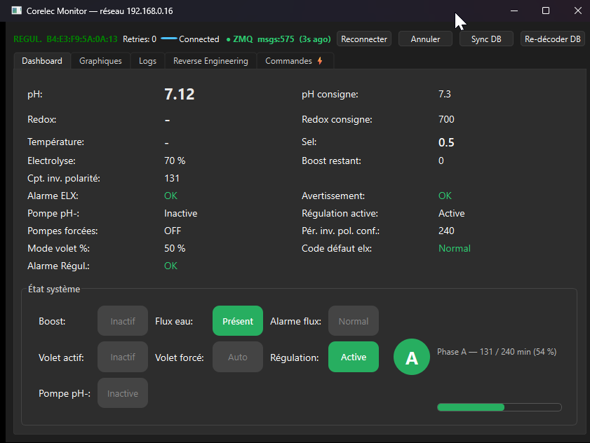
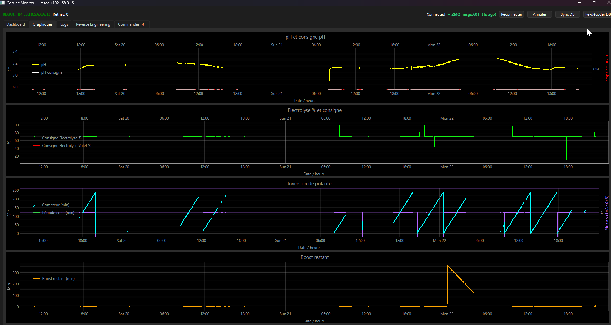
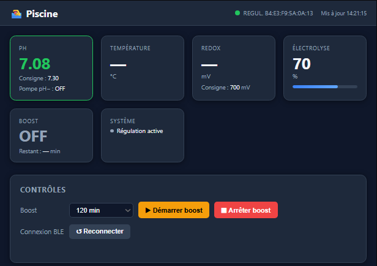

# Corelec Monitor

Supervision et rétro-ingénierie d'un régulateur de piscine **Corelec / Akeron** via BLE.  
Intercepte, décode et affiche les trames en temps réel. Architecture daemon headless (Pi3) + UI Qt + serveur web + intégrations HomeKit / MagicMirror.

Desktop UI:




Web UI:




## Architecture

```
+--------------------------+                +--------------------------+   ZMQ PUB/PULL   +---------------------------+
|  Pool Regulator          |    Bluetooth   |  Raspberry Pi 3          | <--------------> |  PC / Mac                 |
|  Akeron / Corelec        |<-------------->|  ble_daemon.py           |                  |  monitor.py --network IP  |
|  Bluetooth               |   Low Energy   |  BLE . Decoder . SQLite  |                  |  Dashboard Qt             |
| ecltrolyse, pH, salt, ...|      (BLE)     |  :5555 PUB  :5556 PULL   |                  +---------------------------+
+--------------------------+                +------------+-------------+
  mac address to find via                                | ZMQ SUBSCRIBE
  bluetooth device explorer                              v
  app (PC or phone)                           -> web_server.py  ->  http://nas:8080
  ex: "nRF Connect"                              Dashboard HTML  . /api/state . /api/stream (SSE)
                                              -> MagicMirror2
                                              -> Homebridge / HomeKit -> iPhone HomeKit
```

Mode direct sans Pi :  `python monitor.py --address B4:E3:F9:5A:0A:13`

---

## Démarrage rapide

```bash
# Pi3 — daemon headless
sudo bash raspi/install_raspi.sh B4:E3:F9:5A:0A:13

# PC — interface Qt (mode réseau)
pip install -r corelec/requirements_windows.txt
python monitor.py --network 192.168.0.16

# NAS / serveur — dashboard web
pip install -r corelec/requirements_web.txt
python web_server.py --daemon-host 192.168.0.16 --http-port 8080
```

---

## Documentation

| Sujet | Fichier |
|---|---|
| Structure du code, SQLite, flux de données | [docs/ARCHITECTURE.md](docs/ARCHITECTURE.md) |
| Protocole BLE (trames, bytes) | [PROTOCOL.md](PROTOCOL.md) |
| Protocole réseau ZMQ, topics, API HTTP | [docs/NETWORK.md](docs/NETWORK.md) |
| Installation (Pi3, Windows, systemd, web) | [docs/INSTALL.md](docs/INSTALL.md) |
| Interface Qt et web | [docs/UI.md](docs/UI.md) |
| Intégrations (HA, MagicMirror, Homebridge) | [docs/INTEGRATIONS.md](docs/INTEGRATIONS.md) |
| Bibliothèque Ada | [ada/README.md](ada/README.md) |
| Firmware ESP32 NimBLE + MQTT | [esp32/README.md](esp32/README.md) |

---

## État du projet

| Composant                         | État                  |
|---------------------------------- |-----------------------|
| Acquisition BLE (bleak)           | ✅ Fonctionnel        |
| Décodeur trames 77/83/65/69       | ✅ Fonctionnel        |
| Stockage SQLite                   | ✅ Fonctionnel        |
| Dashboard graphiques Qt           | ✅ Fonctionnel        |
| Rétro-ingénierie UI               | ✅ Fonctionnel        |
| Daemon headless (ble_daemon.py)   | ✅ Fonctionnel        |
| Protocole réseau ZMQ/JSON         | ✅ Fonctionnel        |
| Sync DB réseau                    | ✅ Fonctionnel        |
| Dashboard web (web_server.py)     | ✅ Fonctionnel        |
| Plugin MagicMirror²               | ✅ Fourni             |
| Plugin Homebridge / HomeKit       | ✅ Fonctionnel        |
| Scripts systemd Pi3               | ✅ Fonctionnel        |
| Scripts systemd NAS Synology      | ✅ Fonctionnel        |
| Compatibilité PyQt5 & Pi3 (Qt UI) | ⚠ Via apt uniquement  |
| Bibliothèque Ada                  | 🚧 En cours (0.1-dev) |
| Backend BLE Ada (BlueZ/BTstack)   | ⏳ Non démarré        |

---

## Licence

MIT
