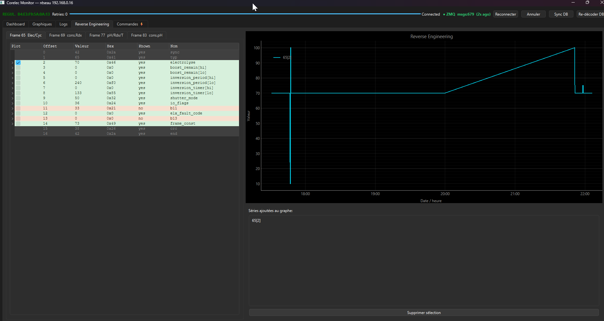

# Interface utilisateur Qt

## Dashboard

- Valeurs temps réel : pH, Redox, Température, Sel, Électrolyse
- État des commutateurs : Boost (durée restante), Flow switch, Volet actif/forcé
- Alarmes et warnings décodés
- Métriques BLE : RSSI, paquets envoyés/reçus, uptime connexion
- Bouton **Sync DB** (mode réseau) — télécharge la base `raw_frames` depuis le daemon

---

## Graphiques

- **pH et consigne pH** — axe secondaire droit pour l'état de la pompe pH− (0/1)
- **Électrolyse % et consigne volet**
- **Cycles A / B**
- Curseur interactif : barre verticale + labels valeurs au survol de la souris  
  (la barre suit librement le pointeur, les labels s'ancrent au point le plus proche de chaque série)

---

## Rétro-ingénierie

Table byte-par-byte pour chaque type de trame (65 / 69 / 77 / 83) :

- **Coloration** : vert = octet décodé/connu, orange = inconnu
- **Colonne Name** : nom du champ dérivé automatiquement depuis `ctypes_frames.py`
- **Lignes dépliables** : chaque bit de l'octet affiché individuellement (valeur 0/1), nommé si connu
- **Case « Plot »** par octet **ou par bit** → courbe booléenne en temps réel dans le graphe libre
- **Clic droit** sur une sélection : interprétation uint16, int16, float16, ASCII, bitmask

Graphe libre : séries ajoutées manuellement via le panneau de droite.

> Les structures `ctypes_frames.py` sont la **source unique de vérité** pour les offsets et les noms
> de champs. `_known_offsets` et `_offset_names` sont dérivés automatiquement depuis `_BE._fields_`.

---

## Logs

Vue console avec coloration par niveau (DEBUG / INFO / WARNING / ERROR).

---

## Interface web (`web_server.py`)

Dashboard responsive HTML/CSS/JS — aucune dépendance externe (zéro CDN) :

- Cartes colorées : pH (vert/jaune/rouge selon consigne ± tolérance), Température, Redox, Électrolyse (barre de progression), Boost (animation pulsante si actif)
- Bannière d'alarme rouge si `alarme` ou `flow_alarm` actif
- Contrôles : démarrer/arrêter boost (durée configurable), reconnexion BLE
- Mises à jour live via **Server-Sent Events** (pas de WebSocket — fonctionne derrière un proxy)
- Compatible mobile (CSS Grid responsive)
